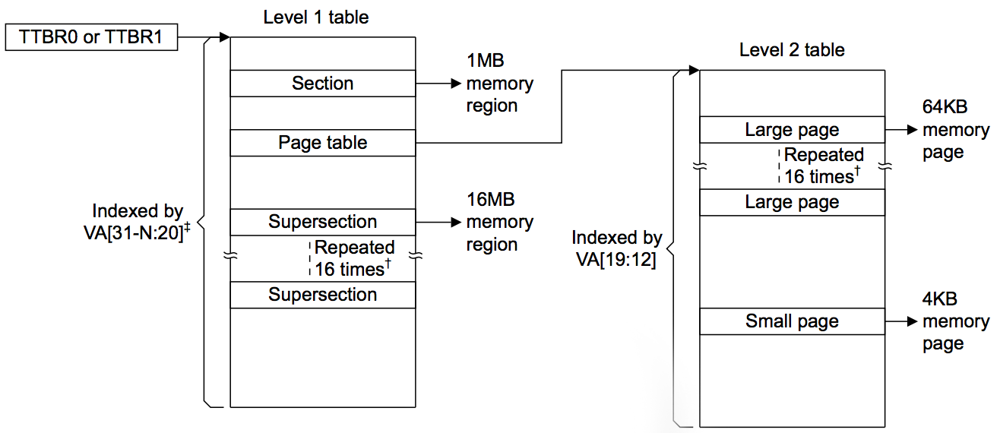
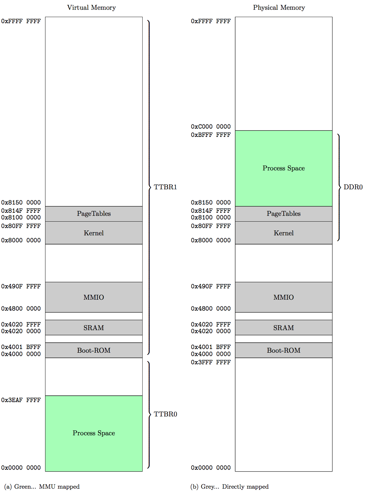

## MMU
There are serveral different memory system architectures that exist for ARM architectures. One of those memory architectures is the protected memory system architecture, which is not used in our case. Our system has 4 GB physical memory which is built upon a virtual memory system architecture. This architecture needs a component called "Memory Management Unit" and tables containg memory regions and attributes for each region. How those tables are used and how the memory map looks like are part of this chapter.

### Funcionality
If the system is started with the MMU, the system is running with virtual memory, which is configured via settings. The mapping between physical and virtual memory is handeled by the MMU. Virtual addresses can be directly mapped, but do not have to. Therefore the MMU needs information how to map addresses, the so called translation tables. 

While the CPU is accessing a virtual address, the MMU has two supporting components, which are used to get the correct physical one. One is the "Translation look-aside buffer" short TLB, which is a cache of already translated addresses. This cache is of course limited, therefore not all translations can be saved inside. If a translation of an address is already inside, the MMU can resolve the physical address immediately, otherwise it has to find the address via a table walk. How the table walk works is described in the "Translation Table" section.

<figure>
    <a href="images/mmu_architecture.png">
       
    </a>
    <figcaption>
        Shows the architecture of the MMU - OMAP35x Technical Reference Manual 
    </figcaption>
</figure>


**TODO**
The MMU offers two major benefits:
• Memory defragmentation: Fragmented physical memory can be translated into contiguous virtual memory without moving data.
• Memory protection: Illegal, that is, non-allowed accesses to memory locations can be detected and prevented.

### Translation Table(PageTable)
Translation table contain entries which have all the information included for translating a virtual address to a physical one and to resolve the type of memory accessing. The There are different types of translation tables:

+ First-level table (L1)
+ Second-level table (L2)
+ **TODO: thrid-level?**

There can be different interpretations for L1 and L2 tables dependent on the configuration. One method describes the existance of only one L1 in the whole system containing one L2 for each process. Another one is the existance of one L1 for each process containg multiple L2 tables. We have chosen the second method, because a process can be significantly bigger than in the first method.

<figure>
    <a href="images/table_walk.png">
       
    </a>
    <figcaption>
        Shows a two level translation table - ARMv8 Architecture Reference Manual 
    </figcaption>
</figure>

#### First-level table
A first-level table consist of a maximum of 4096 entries each 4 bytes large. Depending on the format of the entry, it describes a section, supersection or a L2 table. Sections or supersections are normally used to describe big memory sections like the MMIO. Processes which can be seperated into smaller parts for a more efficient memory allocation and defragmentation, a L2 table is used.

| Entry type    | Describes           |
| ------------- | ------------------- |
| Super Section | 16 MB memory region |
| Section       | 1  MB memory region |
| Page Table    | L2 table            |

#### Second-level table
A second-level table consist of a maximum of 256 entries each 4 bytes large. Depending on the format of the entry, it describes a large or a small page.

| Entry type    | Describes           |
| ------------- | ------------------- |
| Large Page    | 64 KB memory page   |
| Small Page    | 4  KB memory page   |

The reason why different sizes are available is a mixture of performance and space-saving. A 4 GB system built up only on small pages would lead to a 32 MB large translation table.

Both tables, the first and the second translation table have to be correctly aligned. A supersection and a large page are only multiples of the smaller types. If such types are used, the entries have to be repeated 16 times.

#### Table walk
A table walk is the procedure how a given virtual address is translated to a physical one. Depended on the type of the address accessed (sections or pages) different table walks are used. Following images show the translation walk for a section and a small page, which were used in this project.

<figure>
    <a href="images/table_walk_section.png">
       
    </a>
    <figcaption>
        Shows a table walk for a section - ARMv8 Architecture Reference Manual 
    </figcaption>
</figure>

<figure>
    <a href="images/table_walk_small_page.png">
       
    </a>
    <figcaption>
        Shows a table walk for a small page - ARMv8 Architecture Reference Manual 
    </figcaption>
</figure>

#### Descriptor Formats
**TODO**

### OS vs Process
The MMU offers a feature to explicitly differ between process and operating system space. Therefore the so called "Translation Table Base Register" short TTBR is used.

If the described feature is not used, the whole virtual memory has a reference to one running process. For example, a user process is currently running. It want to call a driver function, so the user process has to be swapped with the operating system. The TLB has to be flushed and the L1 or L2 (dependent on the configuration) has to swapped. To avoid this performance decrease, two translation tables are always loaded: the translation table of the operating system (TTBR1) is loaded once and the translation table of the process (TTBR0) is swapped, if the current running process is switched. Accessing the operating system do not lead in a switch now. 

### Memory Map 
We used a virtual memory system architecture together with the seperation of OS and process. The process space (TTBR0 - 1 GB) is a quarter of the whole memory and only contain process specific information. The rest of the memory is used for the OS (TTBR1 - 3 GB) where next to our kernel implemenation and translation tables, all the hardware specific information is located. 

| Memory Region | Size    | Mapped          |
| ------------- | ------- | --------------- |
| Process Space | 1003 MB | Virtual mapped  |
| Boot-ROM      | ~2  MB  | Directly mapped |
| SRAM          | 64  KB  | Directly mapped |
| MMIO          | ~17 MB  | Directly mapped |
| Kernel        | ~16 MB  | Directly mapped |
| Page Tables   | ~5  MB  | Directly mapped |

**Hint: Each process consist of one L1 and >= one L2 tables. For easier calculation each process has one L2. In a 5 MB region could have ~300 processes space.**

<figure>
    <a href="images/memory_map.png">
       
    </a>
    <figcaption>
        Shows the memory map of our system
    </figcaption>
</figure>

### Implementation
First of all the whole MMU has to be initalized together with all the memory regions which are mapped directly. After this, the first L1 is created, containing all directly mapped memory regions. Afterwards all necessary settings like the size of OS and process have to be set.  

```c
void mmu_init(void)
{
    // initialize memory regions
    memoryManager_init();

    // disable mmu, to configure it
    mmu_disable();

    // create OS master page table
    // and has always a size of 16kB + alignment
    mmu_createMasterPageTable();

    // set ttbr1 and ttbr0 for
    // OS and Process page table
    mmu_setTTBR1(masterPageTable);
    mmu_setTTBR0(masterPageTable);

    // set boundary (size of ttbr1 and ttbr0)
    mmu_setTTBCR(BOUNDARY_QUARTER);

    // set domain
    // atm full access
    mmu_setDomain(0xFFFFFFFF);

    // enable MMU
    mmu_enable();
}
```

After the MMU is initalized, error handling and creating pages are close to each other. If a memory access occures and the address trying to access is not mapped yet, a data abort error is thrown. This error can be catched to get the error code. Dependent on the error code, a page table or a page entry can be created. After the creation, the interrupted process can continue.

```c
void mmu_dabt_handler(void)
{
    // load dabt details via asm
    uint32_t dataFaultAddress = __mmu_load_dabt_addr();
    uint32_t dataFaultStatusRegister = __mmu_load_dabt_status();
    // Bit 10 + 3-0 for fault status
    // shift bit 10 to 4 to get one value
    unsigned int dataFaultStatus = ((dataFaultStatusRegister & 0x400) >> 6) | (dataFaultStatusRegister & 0xF);

    PCB_t* currentProcess = scheduler_getCurrentProcess();
    if (currentProcess == NULL) {
        return;
    }

    // check
    switch(dataFaultStatus) {
        case DABT_TRANS_SECTION_FAULT:
            // L2 needed
            mmu_createL2PageTable(dataFaultAddress, currentProcess);
            break;
        case DABT_TRANS_PAGE_FAULT:
            // Page frame needed
            mmu_createPageFrame(dataFaultAddress, mmu_getL2PageTable(dataFaultAddress, currentProcess->pageTable));
            break;
        default:
            // error cannot be handeled
            scheduler_killProcess(currentProcess->processID);
            break;
    }
    
    // go back to interrupt handler
}
```

#### Allocating page
If a page is already allocated or not is check based on a bitmap. **TODO**

#### Killing a proccess
After killing a process all the entries and space of the process has to be cleared. **TODO**

### Work in progress
+ ASID

At the moment, after a process switch, the whole TLB is flushed. Using TTBR0 and TTBR1, the TLB contain entries of the OS and the current process. For clearing only the entries of the process ASID should be used. ASID is a flag in the TLB, which is used to indicate which entry is associated to which process.

+ Supersections&Large pages

For reasons of simplification, supersections and large pages are not yet implemented, because entries would have been repeated in the translation table.  

+ ROM-Exception vectors

**TODO** current problem is, that process could inject sth through exp vectors

