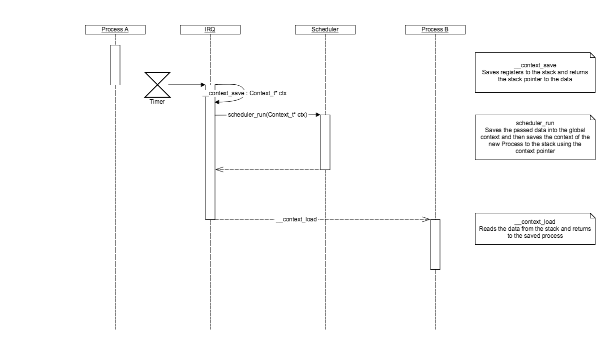
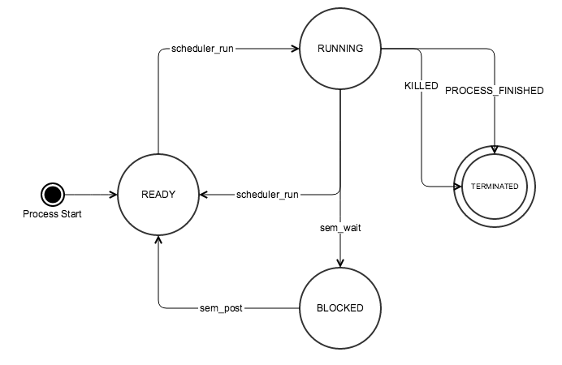

## Scheduler

### Sequence
The following UML diagram shows the cycle of the scheduler.

`__context_save` is a assembly method which is called by the IRQ handler right at the beginning.
It saves all the needed registers into the stack and returns a pointer to the data.
In `C` we use a `struct` for that. It must be ensured that we save all our data in same order onto the stack as the struct is registered.
This is done for every IRQ that occurs, not only the timer IRQ.

Then the IRQ handler will call the callback method of the Timer Interrupt, which is the scheduling method.
There all data from the stack are copied to the context array using the passed pointer.
The scheduler then will search for a the next process using Round Robin.
The current process state is set to `ready` and the new process gets the state `running`. Also the scheduler replaces the context data with the new process data on the stack.

`__context_load` is also a assembly method which is called by the IRQ handler at the very end.
It loads all data from the stack and writes them to the registers. Also it ensures that the stack is cleaned from all data after we exit.
At the very end it jumps back to the new process, otherwise to the interrupted process.

### Details

The runtime of a process is about 100 ms. We chose this value because of the console and audio performance. Currently we don't use any audio buffer, which is why there are breaks in the output. With shorter runtimes there are more breaks, with longer runtimes the reaction time of a process is getting higher. Having a process runtime of 100 ms is a good tradeoff between audio and input reaction time.

The scheduler supports currently only eight processes as we have not ever needed more to this time. However the number of processes can be easily extended.

### Process States

All processes start with the ready state. The scheduler sets processes to `running` or `ready`. Some processes may get `blocked` when using the semaphore (see IPC). If an error occurs or a process finishes it gets terminated.

