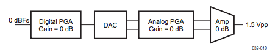

## Applications

### Greetings

### Audio player
The audio player application simple plays a song, the children's song "All my little ducklings". As described in the Audio section of this documentation, we are using a dual phase audio format. Therefore the AudioDriver offers two relevant methods to play sound: `mcbsp_driver_play_left()` and `mcbsp_driver_play_right()`. In the first version of the driver, the data is written without any buffer onto the audio device.

First we specified our frequency scale based on the equal-temperated scale of A4=440Hz. We only used two full octave ranges from A3 to G5. To see a list of all usual frequencies go to the [Physic's Department of Michigan Tech](http://www.phy.mtu.edu/~suits/notefreqs.html). With this information, the actual frequency of a given tone can be calculated. The song is written like the example song in the code snippet below. Each note is represented as a character and can be sustained using numbers (2 for half-notes or 4 for full-notes). The x represents the level of the note, meaning high or low in our simplified scale.

```c
static int audio_get_frequency(char note, int level) {
	return AUDIO_SAMPLE_RATE / audio_frequencies[note - 'A' + 7 * level];
}

// Example song
static char allmyducks[] = "CDEF2G2GxAxAxAxA4GxAxAxAxA4GFFFF2E2EGGGG4C";
```

The audio sample rate is set to 48kHz based on the the Nyquist criterion. For simplification we ditched semitones and as described before, only represent the pythagorean scale. The actual method to send the audio data to the audio interface is called `audio_play_wave(int frequency, int channels, int length)`. In order to calculate the correct data that needs to be sent to the interface, we must specify the audio bit depth. This constant is the number of bits of information in each sample, for our 16bit linear-PCM a maximum of 32767 decimal value - representing 0dB. The higher the audio bit depth, the better the audio quality and the less quantization errors will occur, increasing the signal-to-noise ratio. In our system, the SNR is around -96dB, meaning the minimum possible amplitude is this value and can be seen as silence.

The code snippet below shows how the systemcalls to the audio driver are used. The generated audio sample is send to the left and to the right channel as stated before (dualphase). Based on the input tone (in our case each of the allmyducks string) the amplitude of each tone is calculated and is then used to create the sine sample.

```c
// st = sustain length
// frequency = wave length
for (j = 0; j < duration; j++) {
  (...)

  int amplitude = (at - amplitude_start) * j / duration + amplitude_start;
  int v = (st * 2 - frequency) * amplitude / frequency;

  syscall(SYS_AUDIO_PLAYL, (uint32_t*)(v), 1);
  syscall(SYS_AUDIO_PLAYR, (uint32_t*)(v), 1);

  (...)
}
```

The figure below (from TPS65950 Integrated Power Management and Audio Codec) shows the path the samples has to go through using the headphone output on the beagleboard. The configuration we used is based on 0dB as in the figure.



#### Driver extension
The next step would be to add support for different audio formats, like MP3, ogv or aif. There are a lot of third party libraries written in C which could be addded.
Beneath the audio formats, filters and other audio enhancement plugins could be designed, created and added to the audio driver. Possible addons would be simple Filters like lowpass, highpass or processing filters like chorus, delay or phaser. The basic filters are already available on the TPS65950 submodule "Digital Audio Filter Module" offering a High-pass, Low-pass and a randomizer.
