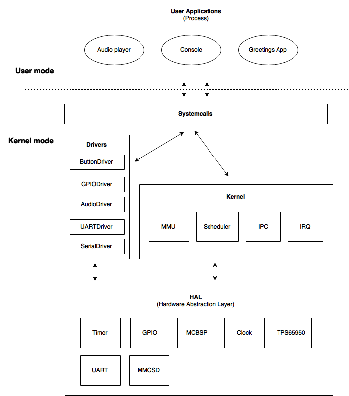
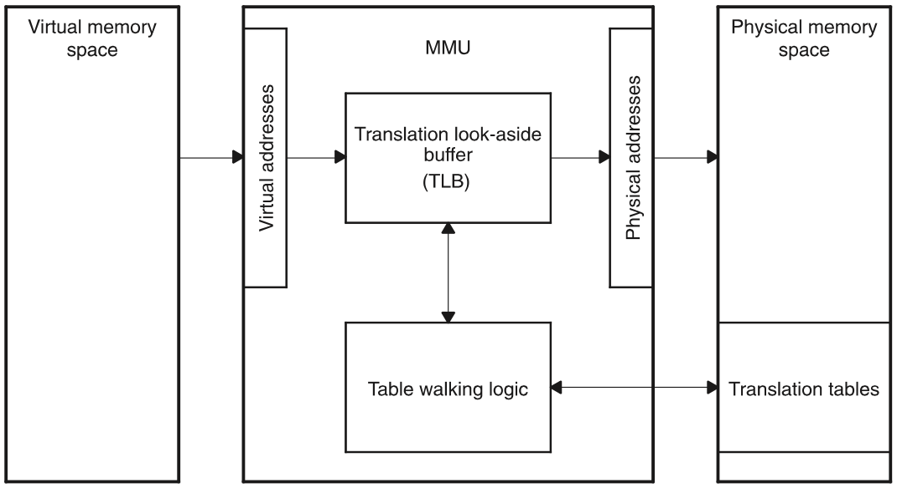
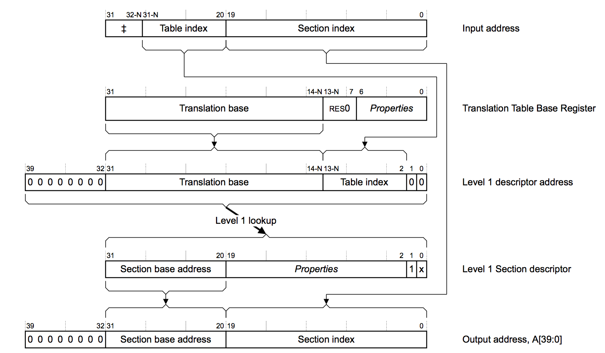
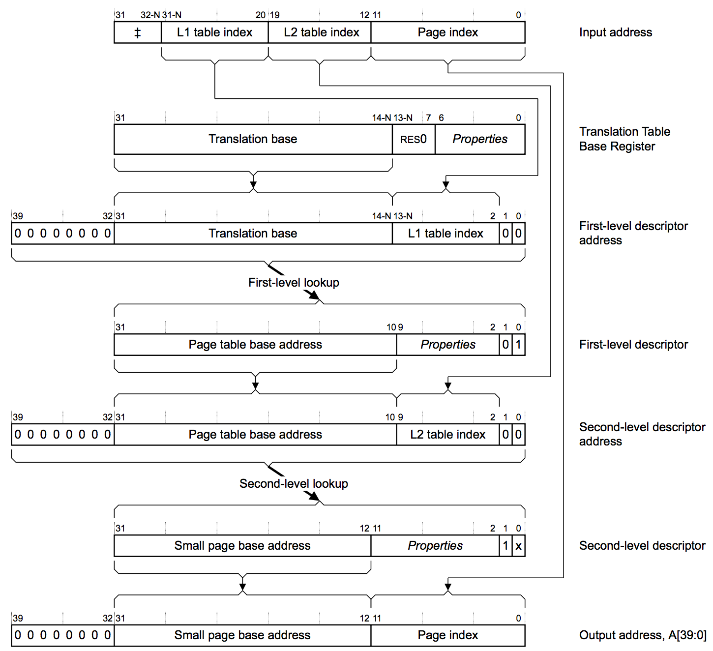
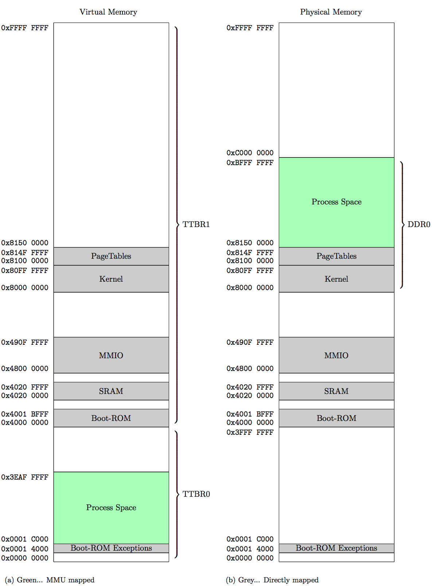
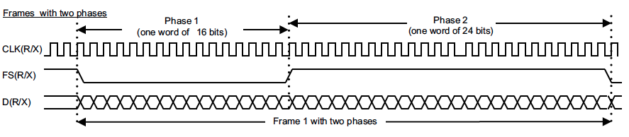
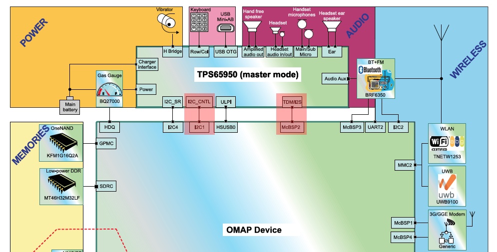

# Documentation FluxOS
Philip H., Florian M., Nino S.

## Table of content
+ Overview
+ Project management
+ Architecture
+ UART
+ Timer
+ Interrupts
+ Scheduler
+ IPC
+ MMU
+ Filesystem
+ Audio
+ Applications
+ TODO

## <a name="Overview"></a>Overview

### Requirements of the project

- Monolithic kernel
- Virtual memory management
  - provide MMU functionality
  - each process owns a separate virtual area
  - each process acts the same way (as how it see's virtual memory)
- Simple process scheduling
- Single processing
  - no multithreading needed
  - only Processes, no Threads
- System calls
  - library with basic methods
- PCB (Process Control Block)
  - Information about process (esp. state)
  - own Stack for each process
- Driver architecture
  - define a architecture to use different modules of the board
- Interrupt-based UART
  - simple read and write functionality
- IPC
  - Semaphores
- Console application
  - a simple console to execute processes
- Memory card
  - use of external memory to load process/data
  
## <a name="ProjectManagement"></a>Project management 

For this project we are using a trimmed version of SCRUM. As toolset we are relying on the Github internal capabilities like issues and milestones.

### Scrum Task Board
All of our tasks (represented as issues) are visible in our scrum task board consisting of the columns Backlog, Ready, In Progress and Done. The Backlog column makes all items of the sprint backlog visible. The next column contains all items which are ready to be worked on, followed by the In Progress column. This column shows other team members or stakeholders who is working on which task. The last column gives an overview of already done and finished tasks.

**Waffle.io** provides the possibility to show the Github issues in the previously described scrum task board and adds scrum points and assigned members view.

The board is accessible via [https://waffle.io/flomath/fhv-os](https://waffle.io/flomath/fhv-os).

### Milestones
In order to get started we set deadlines and tasks which needed to be done. After the first weeks we managed to work on separate tasks independently and could ditch the detailed sprint planning.

#### Milestone 1 - Ideas, Brainstorming and Kick-off
The first sprint is to define the basic concept of our operating system and the possible application area. It also contains the very basic architecture thoughts which will be refined in the following sprints.

#### Milestone 2 - UART and Scheduler
In the second sprint the UART is implemented as generic and OMAP specific code. It is possible to send or receive data via UART to the RS232 interface. A generic driver allows the usage of UART by any process. A very basic scheduler foundation is available to enqueue processes or tasks and provide a interface to enable interrupt-based scheduling on the basis of a simple scheduling algorithm.

#### Milestone 3 - Timer, Interrupt, MMU
It is possible to trigger an interrupt via a timer by adding the timer to the generic interrupt handler. A simple task can be scheduled, for example every 10 seconds using the scheduler, interrupt and timer. The first steps towards an MMU is done by writing a guide and documentation on how to use and implement it.

#### Milestone 4 - IPC and Software Interrupts
It is possible for processes to communicate with each other using some IPC mechanism provided by the operating system. Also processes, which are running in the user mode, gain access to methods of the operating system via software interrupts.

#### Milestone 5 - Audio, Loader, SD Card
Processes can play audio signals. Also the SD card is accessible and a minimalistic file system, that can at least read data, is implemented. It must be possible to start processes that are not compiled into the operating system using a binary data format. Instead they are loaded from the SD card.

### Github
Github not only offers us the possibility to create issues and use them as scrum tasks but, of course version control. The public repository can be accessed here [https://github.com/flomath/fluxos/](https://github.com/flomath/fluxos/).

Every important module resp. bigger task was created using its own branch. This allowed us to independently work on different topics without interfering other team members with unfinished code or different configuration settings. In the end we created 12 different branches which of two are for documentation. All of the others are merged into the master branch using pull requests.

## <a name="Architecture"></a>Architecture

This chapter will give a brief overview of our suggested architecture for a monolithic operating system in an embedded oriented environment. Important modules will be discussed in more detail in the following chapters.

### Structure of FluxOS

The architecture is split into a user and kernel section. The figure below gives an overview of all modules involved.
For a cleaner separation of user applications and operating system we introduced system calls. These methods either uses kernel internal methods or an abstraction called driver to run actions in the supervisor mode instead of the default user mode. A driver publishes a standardized interface for various modules like Audio, UART or the serial bus. The driver usually offers isolated functionality for a specific HAL module, but can also act on different HAL or kernel modules.

The HAL is the closest unit to the hardware and access registers and modules on the operated board. There are the base or common methods (acting as interface) and the hardware specific implementation (for this project the OMAP3530). For reasons of simplification not all methods and constants used in the OMAP3530-HAL are available in the common HAL and need to be added in a feature release.



## <a name="UART"></a>UART
Universal Asynchronous Receiver Transmitter is a serial port which allows the MC to communicate with other devices such as input sensors, LCDs or other computers. Sending the data is done bit by bit with a so called baud rate. This rate is the total amount of bits transmitted per second (bits/sec). The UART does not has any clock - thats why it is asynchronous.

+ General rule of thumb for baud rates: 9600
+ RxD (Receive)
+ TxD (Transmit)
+ Gnd

### Usage of UART
To use the UART (for example sending data via RS232) the `uart_driver_init()` method of the "UartDriver" must be called with the baud rate as parameter. The driver then initializes the UART1 module with a length of 8 bits for each received or sent packet. Currently it is not possible to change this setting.

The UART driver offers two methods to interact with devices connected to the UART interface: write and read. The console is based on these two methods to react to the user input and perform actions based on it. To do so, the console and the UART driver are using Semaphores for a proper communication manner. See Inter-Process Communication chapter for more details.

`uart_driver_write`  
This method will write the given data packet-wise to the UART registers. It is based on a simple loop iterating over the data and calling the `uart_write` method of our HAL.

`uart_driver_read`  
This method will read character by character from the UART device. There is also a check if all data was received in one go. If not, the `uart_driver_interrupt` will take care of the rest of the data later on.

### RS232
The RS232 communication sends either 1, called a *Mark* or 0, called *Space*. During idle state the communication continuously transmit 1.

## <a name="Timer"></a>Timer
The beagleboard (OMAP) offers 11 general-purpose timers (*GPT_*). We used a 1-ms Tick Generation with input clock of 32.768 Hz. To setup the timer we must set the negative and positive increment register which is calculated based on the "TimerClock" and tick count. The OMAP guide as example configuration uses 1-ms tick and the 32.768Hz clock with a positive value of 232000 and negative of -768000. The timer load value is set to 0xFFFF FFE0 which leads to an interrupt period of 65.5 μs.

As example we are using the "GPT\_TIMER\_10" with "GPT10\_IRQ". This is mapped to "M\_IRQ\_46" in the interrupt handler routines. Timer 10 and 11 are on the core module (Powerdomain *CORE*) which defaults to 32kHz clock. Timer 1 to 9 are on the Powerdomain *PER* [see p.2599]. Using overflow mode, the TLDR value or overflow rate is expressed as `OVF_Rate = (0xFFFF FFFF - GPTn.TLDR + 1) * (timer-functional clock period) * PS`. If no prescaler is used, PS=1. The timer functional clock period is `1/clock frequency`.

One of the applications in our operating system using timers is the task scheduler. Each 100ms the timer interrupt is fired in order to call the `scheduler_run()` method.

## <a name="Interrupts"></a>Interrupts

The interrupt vectors must be defined in the [linker script](https://github.com/flomath/fluxos/blob/master/beagleboard.cmd). They need their own memory section:

```
/** beagleboard.cmd **/
MEMORY
{
	BOOTROM:	    o = 0x40000000	l = 0x0001BFFF	/* BOOT ROM */
	SRAM:           o = 0x40200000  l = 0x0000FFC8  /* 64kB Internal SRAM */
	EXCEPTIONS:		o = 0x4020FFC8	l = 0x00000037	/* RAM exception vectors */
	DDR0:           o = 0x80000000  l = 0x40000000	/* 1GB external DDR Bank 0 */
}

SECTIONS
{
    .intvecs    > EXCEPTIONS
    .intvecs_impl > SRAM
...
```

The interrupt handlers are than defined in the [intvecs.asm](https://github.com/flomath/fluxos/blob/master/intvecs.asm) file. Ensure that the memory addresses are the same as referenced in the technical reference manual, table 25-10.

The defined handlers can be written in C with the help of `#pragma INTERRUPT(method_name, IRQ)` to ensure that the methods are correctly linked. Those handlers need to be extracted to another memory section, because the allocated space for the RAM exception vectors is too small. Therefore the pragma `SET_CODE_SECTION` was used to set the code section of the handlers to "[intvecs_impl](https://github.com/flomath/fluxos/blob/master/src/system/hal/omap3530/interrupt/interrupt.c#L65)", which is a section located in the SRAM.  

```c
#pragma SET_CODE_SECTION(".intvecs_impl")
#pragma INTERRUPT(irq_handler, IRQ)
void irq_handler(void) {
    ...
}

#pragma INTERRUPT(dabt_handler, DABT)
interrupt void dabt_handler(void) {
    ...
}

...
```

Because we will enter the Interrupt System Mode whenever an interrupt occurs, we also need to define a [stack](https://github.com/flomath/fluxos/blob/interrupts/boot.asm) for this mode. If this is not done, we will receive Memory Abort Exceptions whenever we are trying to call a method in the ISR.

### Activate an IRQ
To activate an interrupt for a device, a bit in the `MPU_INTC_INTCPS_MIR` register has to be enabled (table 10-4 OMAP35x reference guide) and the implemented function `void interrupt_add_listener(uint32_t irq, interrupt_callback* listener)` has to be called.

### System call
The separation of process and OS space usually means that the process cannot access the OS space, because of the user/system mode. That means that an interface/API is needed to access OS space, a so called system call.

A system call is defined by the interrupt vectors. If such a system call is called, it does not run in the interrupt mode as usual, but does run in the system mode. The declaration of a function in our case `syscall` is needed. This function is annotated with the pragma `SWI_ALIAS`.

```c
#pragma SWI_ALIAS(syscall, 0)
void syscall(uint32_t swiID, uint32_t params[], uint32_t paramLength);
```

The "swiID" is needed, to distinguish between different system calls.

```c
#define SYS_DEBUG	    10
#define SYS_EXIT        20
#define SYS_PRINT       30
#define SYS_READ        31
```

## <a name="Scheduler"></a>Scheduler
Scheduling is an important part of the operating system. We have implemented pre-emptive scheduling which means that a running task is interrupted by the scheduler and continued later on after other processes had some process time.

### Sequence
The following UML diagram shows the cycle of the scheduler.


`__context_save` is a assembly method that is called by the IRQ handler right at the beginning.
It saves all the needed registers into the stack and returns a pointer to the data.
In `C` we use a `struct` for the data. It must be ensured that we save all our data in same order onto the stack as our struct is structured.
This context is saved for every occurring interrupt and not only for the timer IRQ.

All our interrupts have a callback method which will be called by the IRQ handler. In case of our timer this is our scheduling method. As a parameter we pass the context pointer.
There all data from the stack are copied to the static context array using this pointer.
The scheduler then will search for a the next process using a [Round Robin][@round_robin] based method.
The current process state is set to `ready` and the new process gets the state `running`. Also the scheduler replaces the context data with the new process data on the stack.

`__context_load` is also a assembly method which is called by the IRQ handler at the very end.
It loads all data from the stack and writes them to the registers. Also it ensures that the stack is cleaned from all data after we exit.
If we have called the scheduler our context may be altered, which is why we jump to the next process. If this is not the case, we jump right back to the interrupted process.

### Details

**Process Time**

The runtime of a process is about 100 ms. We chose this value because of the console and audio performance. Currently we don't use any audio buffer, which is why there are breaks in the output. With shorter runtimes there are more breaks and with longer runtimes the reaction time of a process is getting higher. Having a process runtime of 100 ms is a good trade-off between audio breaks and input reaction time.

**Number of processes**

The scheduler supports currently only eight processes as we have not ever needed more to this time. However, the number of processes can be easily extended.
The MMU technically supports more processes as we wanted our system to be easily extended.

### Process States

All processes start with the ready state. The scheduler sets processes to `running` or `ready`. Some processes may get `blocked` when using the semaphore (see IPC). If an error occurs or a process finishes it gets terminated.


[@round_robin]: https://books.google.at/books?id=RzP3iH0BSW0C&pg=PA60&dq=round+robin+scheduling&hl=en&sa=X&ved=0CB4Q6AEwAGoVChMI09zbh8fkxgIVRj0UCh03zASs#v=onepage&q=round%20robin%20scheduling&f=false "Real-Time Concepts for Embedded Systems, by Qing Li, Caroline Yao, p. 60"

## <a name="IPC"></a>Inter-Process Communication (IPC)

IPC is needed for processes to communicate with each other and still have good decoupling of processes. An example for its use is resource sharing and process synchronization.

Currently we have implemented a [Semaphore][@semaphore], which is used by our console and the UART driver. The relationship between these two parts can be best described as the producer-consumer problem. We have a producer, which increases a resource that must be *consumed* by some consumer. The consumer has to wait for the resource to be increased.
The console process is the consumer as it has to wait for input data to process. The UART driver is the producer as it processes the input signals to *consumable* data.

The console process is blocked and therefore won't receive any process time as long there is no input coming from the UART driver.

### Semaphore

Our semaphore is always initialized with `0`. Whenever a process needs a resource the semaphore is decreased. If the semaphore value falls below `0`, the processes is set to blocked and is added to a waiting queue. Then another process continues.

When a process increases the semaphore (for example because the resource is not needed anymore) and there are waiting processes the longest waiting is retrieved from the queue and can continue.

Below you can see some parts of our implementation.

```c
void sem_wait(sem_t* sem) {
  // Ensure you don't get scheduled away
  atom_begin();

  // Decrease the semaphore value
  sem->value--;
  if (sem->value < 0) {
    // Get the current process
    int process = scheduler_getCurrentProcessId();

    // Enqueue the process
    sem_enqueue(sem, process);

    // Suspend the process by setting its state to BLOCKED
    scheduler_suspend(process);

    // Ensure that the scheduler can continue
    atom_end();

    // Yield is not implemented, we wait until we get scheduled away
    //yield();

    // Get the process context block
    PCB_t* pcb = scheduler_getCurrentProcess();

    // Wait until state has changed again
    while (pcb->state == PROCESS_BLOCKED);
    // Dirty fix: May happen when there is only one process so that the scheduler won't schedule away
    if (pcb->state == PROCESS_READY) {
      pcb->state = PROCESS_RUNNING;
    }

    return;
  }

  // Ensure that the scheduler can continue
  atom_end();
}

void sem_post(sem_t* sem) {
  // Ensure you don't get scheduled away
  atom_begin();

  // Increase the semaphore
  sem->value++;

  // Deque a sleeping process if there is one waiting
  if (sem->value <= 0) {
    int process = sem_dequeue(sem);

    // Let the process continue by setting its state to READY
    scheduler_continue(process);
  }

  // Ensure that the scheduler can continue
  atom_end();
}
```

[@semaphore]: http://www.cs.utexas.edu/users/EWD/transcriptions/EWD00xx/EWD74.html "Over seinpalen, Dijkstra, Edsger W., Transcription"

## <a name="MMU"></a>MMU
There are several different memory system architectures that exist for ARM architectures. One of those memory architectures is the protected memory system architecture, which is not used in our case. A virtual memory system architecture is built upon our four GB physical memory. This architecture needs a component called "Memory Management Unit" and tables containing  memory regions and attributes for each region to manage the mapping between physical and virtual memory. How those tables are used and how the memory map looks like, are part of this chapter.

### Functionality
The system boots up with the MMU, which configures the virtual memory. The mapping between physical and virtual memory is handled by the MMU. Virtual addresses can be directly mapped, but do not have to. Therefore, the MMU needs information how to map addresses, the so called translation tables.

While the CPU is accessing a virtual address, the MMU has two supporting components, which are used to get the correct physical one. One is the "Translation look-aside buffer" short TLB, which is a cache of already translated addresses. This cache is of course limited and therefore cannot save all translations inside. If a translation of an address is already inside the TLB, the MMU can resolve the physical address immediately, otherwise it has to find the address via a table walk. How the table walk works is described in the "Translation Table" section.



The MMU has some advantages why it is actually used. Memory defragmentation and memory protection. Defragmentation is important to create contiguous memory, therefore physical memory is translated into contiguous virtual memory. Memory protection is important to actually control access of memory.

### Translation Table(PageTable)
Translation table contain entries which have all the information included for translating a virtual address to a physical one and to resolve the type of memory accessing. There are different types of translation tables:

+ First-level table (L1)
+ Second-level table (L2)
+ Third-level table (L3) available, but never used.

There can be different interpretations for L1 and L2 tables dependent on the configuration. One method describes the existence of only one L1 in the whole system containing one L2 for each process. Another one is the existence of one L1 for each process containing multiple L2 tables. We have chosen the second method, because a process can be significantly bigger than in the first method.


#### First-level table
A first-level table consist of a maximum of 4096 entries each 4 bytes large. Depending on the format of the entry, it describes a section, supersection or a L2 table. Sections or supersections are normally used to describe big memory sections like the MMIO. Processes which can be separated into smaller parts for a more efficient memory allocation and defragmentation, a L2 table is used.

| Entry type    | Describes           |
| ------------- | ------------------- |
| Super Section | 16 MB memory region |
| Section       | 1  MB memory region |
| Page Table    | L2 table            |

#### Second-level table
A second-level table consist of a maximum of 256 entries each 4 bytes large. Depending on the format of the entry, it describes a large or a small page.

| Entry type    | Describes           |
| ------------- | ------------------- |
| Large Page    | 64 KB memory page   |
| Small Page    | 4  KB memory page   |

The reason why different sizes are available is a mixture of performance and space-saving. A 4 GB system built up only on small pages would lead to a 32 MB large translation table.

Both tables, the first and the second translation table have to be correctly aligned. A supersection and a large page are only multiples of the smaller types. If such types are used, the entries have to be repeated 16 times.

#### Table walk
A table walk is the procedure how a given virtual address is translated to a physical one. Depended on the type of the address accessed (sections or pages) different table walks are used. Following images show the translation walk for a section and a small page, which were used in this project.





#### Descriptor Formats
As can be seen from the table walk, virtual addresses have different meanings of how they can be evaluated. If an address belongs to a small page, section, etc. depends on the descriptor format.

Next to the type of page it is, the actual base address, access permissions and caching/buffered status bits are part of the descriptor format.

```c
/**
 * Table 3.2. First-level descriptor bits + address
 */
typedef struct {
    unsigned int type;                  ///< Page size and validity
    unsigned int CB;                    ///< Cached and buffered
    unsigned int domain;                ///< Domain control
    unsigned int AP;                    ///< Access permission
    uint32_t sectionAddress;            ///< Address of the section
} mmu_l1_section_t;

/**
 * Table 3.7. Second-level descriptor bits + address
 */
typedef struct {
    unsigned int type;                  ///< Page size and validity
    unsigned int CB;                    ///< Cached and buffered
    unsigned int AP;                    ///< Access permission
    uint32_t pageTableAddress;          ///< Address of page table
} mmu_l2_pageTable_t;
```

### OS vs Process
The MMU offers a feature to explicitly differ between process and operating system space. Therefore, the so called "Translation Table Base Register" short TTBR is used.

If the described feature is not used, the whole virtual memory has a reference to one running process. For example, a user process is currently running. It want to call a driver function, so the user process has to be swapped with the operating system. The TLB has to be flushed and the L1 or L2 (dependent on the configuration) has to swapped. To avoid this performance decrease, two translation tables are always loaded: the translation table of the operating system (TTBR1) is loaded once and the translation table of the process (TTBR0) is swapped, if the current running process is switched. Accessing the operating system do not lead in a switch now.

### Memory Map
We used a virtual memory system architecture together with the seperation of OS and process. The process space (TTBR0 - 1 GB) is a quarter of the whole memory and only contain process specific information. The rest of the memory is used for the OS (TTBR1 - 3 GB) where next to our kernel implementation and translation tables, all the hardware specific information is located.

| Memory Region | Size    | Mapped          |
| ------------- | ------- | --------------- |
| Process Space | ~1003 MB| Virtual mapped  |
| Boot-ROM      | ~2  MB  | Directly mapped |
| SRAM          | 64  KB  | Directly mapped |
| MMIO          | ~17 MB  | Directly mapped |
| Kernel        | ~16 MB  | Directly mapped |
| Page Tables   | ~5  MB  | Directly mapped |

**Hint: Each process consists of one L1 and greater equal than one L2 tables. For easier calculation each process has one L2. In a 5 MB region ~300 processes could have been space.**



### Implementation
First of all, the whole MMU has to be initialized together with all the memory regions which are mapped directly. After this, the first L1 is created, containing all directly mapped memory regions. Afterwards all necessary settings like the size of OS and process have to be set.  

```c
void mmu_init(void)
{
    // initialize memory regions
    memoryManager_init();

    // disable mmu, to configure it
    mmu_disable();

    // create OS master page table
    // and has always a size of 16kB + alignment
    mmu_createMasterPageTable();

    // set ttbr1 and ttbr0 for
    // OS and Process page table
    mmu_setTTBR1(masterPageTable);
    mmu_setTTBR0(masterPageTable);

    // set boundary (size of ttbr1 and ttbr0)
    mmu_setTTBCR(BOUNDARY_QUARTER);

    // set domain
    // atm full access
    mmu_setDomain(0xFFFFFFFF);

    // enable MMU
    mmu_enable();
}
```

After the MMU is initialized, error handling and creating pages are close to each other. If a memory access occurs and the address trying to access is not mapped yet, a data abort error is thrown. This error can be caught to get the error code. Dependent on the error code, a page table or a page entry can be created. After the creation, the interrupted process can continue.

```c
void mmu_dabt_handler(void)
{
    // load dabt details via asm
    uint32_t dataFaultAddress = __mmu_load_dabt_addr();
    uint32_t dataFaultStatusRegister = __mmu_load_dabt_status();
    // Bit 10 + 3-0 for fault status
    // shift bit 10 to 4 to get one value
    unsigned int dataFaultStatus = ((dataFaultStatusRegister & 0x400) >> 6) | (dataFaultStatusRegister & 0xF);

    PCB_t* currentProcess = scheduler_getCurrentProcess();
    if (currentProcess == NULL) {
        return;
    }

    // check
    switch(dataFaultStatus) {
        case DABT_TRANS_SECTION_FAULT:
            // L2 needed
            mmu_createL2PageTable(dataFaultAddress, currentProcess);
            break;
        case DABT_TRANS_PAGE_FAULT:
            // Page frame needed
            mmu_createPageFrame(dataFaultAddress, mmu_getL2PageTable(dataFaultAddress, currentProcess->pageTable));
            break;
        default:
            // error cannot be handeled
            scheduler_killProcess(currentProcess->processID);
            break;
    }

    // go back to interrupt handler
}
```

#### Allocating page
If a page is already allocated or not is check based on a bitmap. To optimize this process, each byte can be checked at the beginning if one bit is free. If every bit is set to one, the next byte can be searched for free space.

#### Killing a process
After killing a process all the translation table entries and space of the process has to be cleared. No shared memory has been implemented, which simplifies the process of killing.

### Work in progress
+ ASID (Address space ID)

At the moment, after a process switch, the whole TLB is flushed. Using TTBR0 and TTBR1, the TLB contains entries of the OS and the current process. While switching the current process only the entries of the process in the TLB should be cleared, not all. ASID is a flag in the TLB, which is used to indicate which entry is associated to which process. Therefore, only the process entries can be cleared which lead to a performance boost.

+ Supersections&Large pages

For reasons of simplification, supersections and large pages are not yet implemented, because entries would have been repeated in the translation table.  

+ ROM-Exception vectors

Currently the ROM-Exception vector table is located in the user process space. It is important to secure this area, that no process can access and moreover abuse them.

+ Max process count

An idea is to directly integrate a max count of processes with a max count of L2 tables for each process. The max count can be evaluated empirically or estimated. So for example each process can have five L2 tables:

```
x * ((1 L1 * 4096 Entries * 4 Byte) + (5 L2 * 256 Entries * 4 Byte)) <= 5 MB (PageTable RegionSize)
x = 213 // Max processes
```

+ Null-Pointer

The address 0x0 has to be considered. If a call on this address takes place, the calling process should be killed.

## <a name="Filesystem"></a>Filesytem

### Card detection
For detecting multi media cards, the basic programming guide of the OMAP35x technical reference manual was implemented (MMC/SD/SDIO). It should be noticed here that time is a important factor. It can happen that a SD card cannot be identified immediately, sometimes a process has to be repeated. This model includes initialization, detection, status, read and write functionality of MMCs.

### FAT16
["FatFs"](http://elm-chan.org/fsw/ff/00index_e.html) was used, to integrate FAT16. It is a generic FAT file system module and is completely decoupled from our system. Therefore the following functions had to be implemented to connect the module to our system:

```
disk_status - Get device status
disk_initialize - Initialize device
disk_read - Read sector(s)
disk_write - Write sector(s)
disk_ioctl - Control device dependent features
get_fattime - Get current time
```

With these functions implemented, the whole application interface can be used, including `f_open`, `f_close`, `f_opendir` and all the rest.

To open and read a file following routine was used. Of course it has to improved in the way of handling directories and files, but at this time, it works to read a file.

```c
	// Fat file system object
	FATFS fs;
	fs.drv = 0;

	// Mount drive
	f_mount(&fs, "", 1);

	FILINFO fno;
	DIR dp;
	FRESULT res;
	unsigned ptr;
	
	// open and read root dir
	res = f_opendir(&dp, "/\0");
	if (res == FR_OK && f_readdir(&dp, &fno) == FR_OK) {
    	//TODO: file only in root path!
    	res = f_open(&file, fileName, FA_READ);
    	
    	if (!res) return;

    	ptr = f_tell(&file); // get read-pointer
    	f_read(&file, buffer, (uint32_t)bufferSize, &ptr); // read 4 byte
    	*bufferSize = ptr;
    	ptr = f_eof(&file); // check if eof is reached - if ptr != 0, go back
    	f_lseek(&file, 0); // set read-pointer to the beginning of the file

    	f_close(&file);
	}
	f_closedir(&dp);
```

### Loader
The loader copies data from a given address and size into a temporary buffer and creates a new process. The new process starts at a fixed address:

```c
#define CODE_START       0x00150000
#define CODE_MAIN_OFFSET 0xc
```

The buffered data is loaded into process space on the start address and its PC is set to the correct address. After this procedure the process state is set to `READY` and can be scheduled.  

### Work in progress

+ Detection of not only SD Card

We only implemented the detection of a SD 1.x card. Other card types or versions like a SDIO card or a SD 2.x card have to be integrated into the process of detection.

+ Write SD

Currently only blocks of MMCs can be read, but not be written. Therefore, the writing function `mmcsd_write_block_data` has to implemented.

+ Time function

The function `get_fattime` has to be modified to fetch always the current time. At the moment it is using the same time.

+ Loader

Currently our loader can just handle one process, because only one buffer exists.

## <a name="Audio"></a>Audio
The operating system offers methods to play audio via the audio output on the beagleboard. To make sound work we used different interfaces on the board which will be discussed in the following chapters.

### MCBSP
The MCBSP or Multichannel Buffered Serial Port offers a full-duplex serial interface between the board and other connected devices. The interface can communicate with a huge amount of different peripherals, such as audio or video devices. For our application we used the audio device using I2S (Inter-IC sound). The beagleboard provides five different McBSP modules, named McBSP1 for digital baseband data, McBSP2 for audio data (with buffer), McBSP3 for Bluetooth voice data, McBSP4 for DBB voice data and McBSP5 for MIDI data.

The modules vital to audio are the McBSP2, which we actually used and the McBSP5 for midi data. In feature releases we could load a midi song, process it and play it via the analog audio output over Inter-IC sound (I2S). The module is configured in order to receive and transmit data with 32-bit word length.

### I2S
The I2S or Inter-IC Sound format is a standard to exchange data between two devices connected on a circuit board. The bus is based on three wires: the bit clock (SCK), the word select line (WS) and the serial data line (SD). One of the two devices acts as Master and must generate the clock and the word select line signals. The data line can be created either by the master or the slave device. The data is transmitted in an alternating manner on the right and the left channel. This is indicated by the WS line so that if the left channel is on, the WS is low and if the right channel sends data, the WS is high.

The McBSP can recognize the alternating because of the WS transition, otherwise both devices must know the word size. The following figure (from the OMAP35x reference manual) shows the signal activity with its alternating phases.



### TPS65950
The last part of our audio setup with the beagleboard is the TPS65950. This device is a power-management and audio coder and decoder. It includes five digital-to-analog (DAC) converters and two analog-to-digital converters (ADC). We used the McBSP as master and therefore, the TPS65950 is the slave which receives frame sync and the bit clock. We only used a small amount of the broad spectrum available to configure this module. A few nice add-ons for our operating system would be the usage of digital audio filters or the headset pop-noise cancellation. A list of all available features can be found in the TPS65950 Integrated Power Management and Audio Codec – Silicon Revision 1.2.

The following figure shows part of the OMAP35x environment using the TSP65950 (from the OMAP35x reference manual).
The TPS65950 is responsible in order to route the audio data from the McBSP to the actual DA converter (digital/analog). The DA converter then sends the signal to the headset jack via TXL/TXR (left and right). We set some basic settings on the module such as headphone amplifier with gain of 0dB, turn on the 16bit audio serial interface, and a sampling rate of 48kHz. This setting allows a fluent and high quality playback of audio files, which most of them are compressed to 48kHz in the consumer field.



## <a name="Applications"></a>Applications

### Greetings
We implemented a simple application called "Greetings" which will be loaded as process. For this reason, we created a `.bin` file and placed it onto the external SD-Card. The code below shows that it uses the syscall-API of fluxOS to print a string.  Using the command `start greet.bin` on the console command line, it will be loaded and scheduled.

```c
/*
 * main.c
 */
#include "../../src/api/syscall.h"
#include <string.h>

int main(void) {
	char* data = "Hello from Process 1";
	syscall(SYS_PRINT, (uint32_t*) data, strlen(data));
	
	return 0;
}
```

### Audio player
The audio player application simple plays a song, the children's song "All my little ducklings". As described in the Audio section of this documentation, we are using a dual phase audio format. Therefore, the "AudioDriver" offers two relevant methods to play sound: `mcbsp_driver_play_left()` and `mcbsp_driver_play_right()`. In the first version of the driver, the data is written without any buffer onto the audio device.

First we specified our frequency scale based on the equal-tempered scale of A4=440Hz. We only used two full octave ranges from A3 to G5. To see a list of all usual frequencies go to the [Physic's Department of Michigan Tech](http://www.phy.mtu.edu/~suits/notefreqs.html). With this information, the actual frequency of a given tone can be calculated. The song is written like the example song in the code snippet below. Each note is represented as a character and can be sustained using numbers (2 for half-notes or 4 for full-notes). The x represents the level of the note, meaning high or low in our simplified scale.

```c
static int audio_get_frequency(char note, int level) {
	return AUDIO_SAMPLE_RATE / audio_frequencies[note - 'A' + 7 * level];
}

// Example song
static char allmyducks[] = "CDEF2G2GxAxAxAxA4GxAxAxAxA4GFFFF2E2EGGGG4C";
```

The audio sample rate is set to 48kHz based on the the Nyquist criterion. For simplification we ditched semitones and as described before, only represent the Pythagorean scale. The actual method to send the audio data to the audio interface is called `audio_play_wave(int frequency, int channels, int length)`. In order to calculate the correct data that needs to be sent to the interface, we must specify the audio bit depth. This constant is the number of bits of information in each sample, for our 16bit linear-PCM a maximum of 32767 decimal value - representing 0dB. The higher the audio bit depth, the better the audio quality and the less quantization errors will occur, increasing the signal-to-noise ratio. In our system, the SNR is around -96dB, meaning the minimum possible amplitude is this value and can be seen as silence.

The code snippet below shows how the syscalls to the audio driver are used. The generated audio sample is send to the left and to the right channel as stated before (dual-phase). Based on the input tone (in our case each of the "allmyducks" string) the amplitude of each tone is calculated and is then used to create the sine sample.

```c
// st = sustain length
// frequency = wave length
for (j = 0; j < duration; j++) {
  (...)

  int amplitude = (at - amplitude_start) * j / duration + amplitude_start;
  int v = (st * 2 - frequency) * amplitude / frequency;

  syscall(SYS_AUDIO_PLAYL, (uint32_t*)(v), 1);
  syscall(SYS_AUDIO_PLAYR, (uint32_t*)(v), 1);

  (...)
}
```

The figure below (from TPS65950 Integrated Power Management and Audio Codec) shows the path the samples has to go through using the headphone output on the beagleboard. The configuration we used is based on 0dB as in the figure.


#### Driver extension
The next step would be to add support for different audio formats, like MP3, ogv or aif. There are a lot of third party libraries written in C which could be added.
Beneath the audio formats, filters and other audio enhancement plugins could be designed, created and added to the audio driver. Possible add-ons would be simple Filters like lowpass, highpass or processing filters like chorus, delay or phaser. The basic filters are already available on the TPS65950 submodule "Digital Audio Filter Module" offering a High-pass, Low-pass and a randomizer.

## <a name="TODO"></a>There is work to do

### Strict separation of User/Kernel Layer

A process is currently able to access kernel methods. In a future version this should be forbidden. However, this issue must wait until `yield` gets implemented as our processes have to use our semaphore directly.

### Yield

A way to schedule away without needing to wait for the timer should be implemented. This is necessary for the semaphore to be called by a syscall as no IRQ will happen during it. Our current implementation of the semaphore waits for the IRQ to happen that's why our system would wait forever.

### Improve System stability

Currently our system may hang forever after a few minutes. This is probably due some implementation error in the scheduling method. Fixing this should massively improve the systems stability.

### Audio performance

Using a audio buffer would improve our audio performance.

### Driver management

FluxOS has a lack of a driver management. Currently our drivers are just initialized in our kernel directly.
